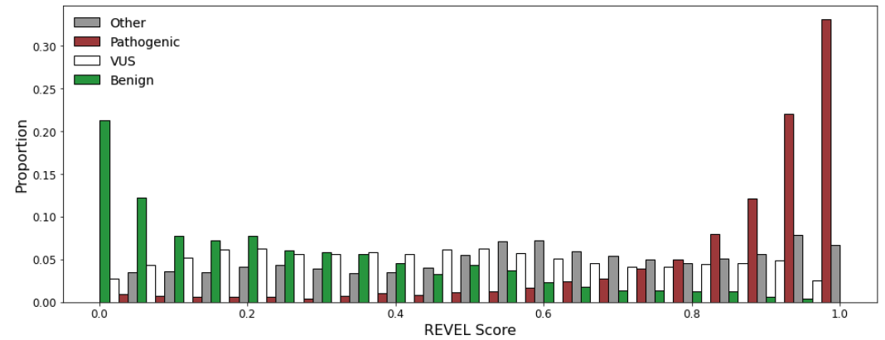
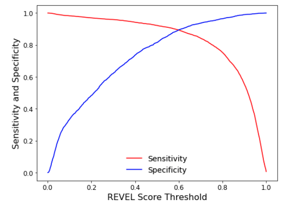
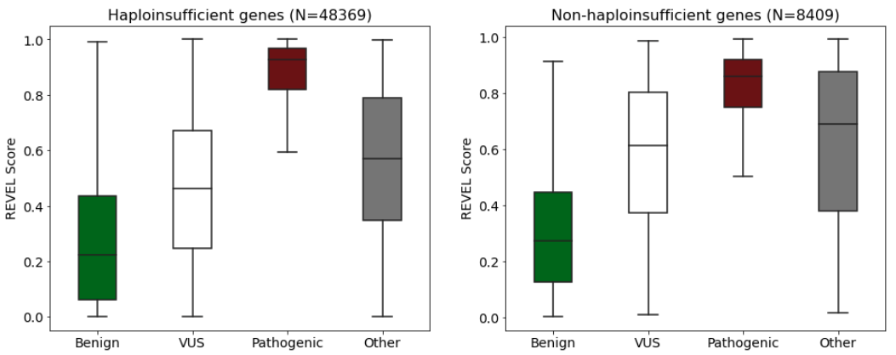
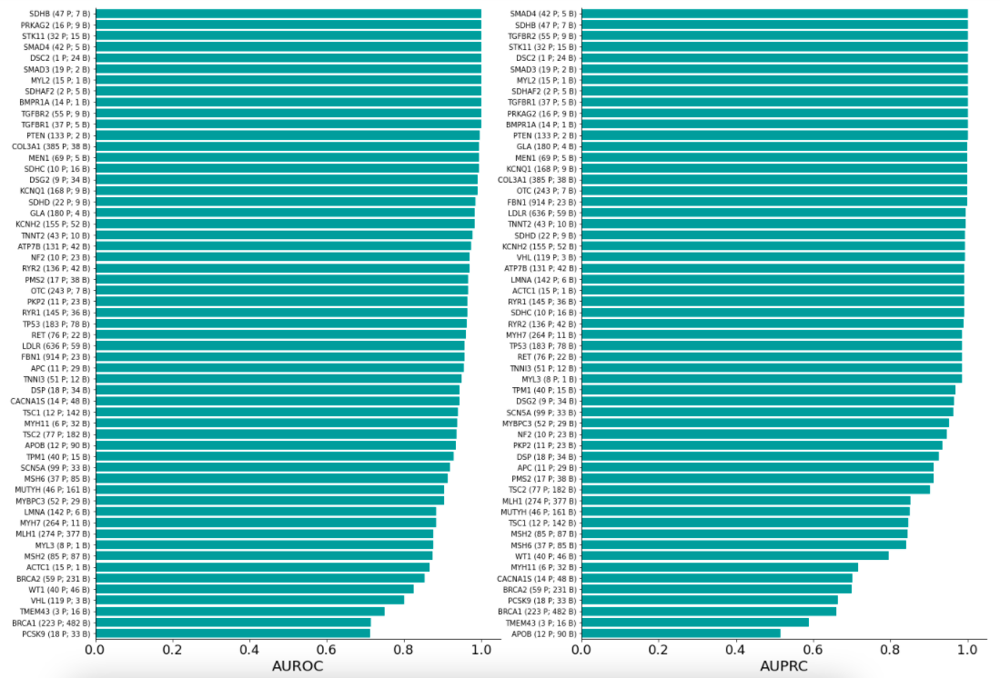

# revel-clinvar

----
#### Table of contents

1. [Background](#1-background)
2. [Analysis](#2-analysis)
3. [Discussion](#3-discussion)
4. [References](#4-references)
5. [Resources](#5-resources)

----
#### 1. Background

High-throughput sequencing technology has led to the discovery of many novel missense variants. Clinical and functional data for these variants are limited to determine the clinical significance. REVEL is an ensemble method for predicting the pathogenicity of missense
variants. Since its publication, it has been recommended and used by several expert panels working in variant interpretation like ClinGen and CanVIG-UK.

While several studies have assessed the performance of REVEL using variants and classifications from databases like HGMD and gnomAD, few focused on clinically actionable genes and variants. In addition, clinical significance of variants from these data sources is not always curated by professionals in clinical genetics or meant for clinical use.

Here I explored REVEL performance in a list of 59 highly penetrant and medically actionable genes (ACMG59 genes) recommended by American College of Medical Genetics and Genomics for reporting of secondary findings.

----
#### 2. Analysis

**Figure 1. Distribution of REVEL scores for variants in ACMG59 genes.**

I compiled a set of 61,391 variants in ACMG59 genes from ClinVar and simplified the classification categories into "Benign", "VUS", "Pathogenic" and "Other". The REVEL score for each variant ranges from 0 to 1. The pathogenic set is enriched with variants with high REVEL scores. In contrast, the benign set is enriched with variants with low REVEL scores.

**Figure 2. Sensitivity and specificity for different REVEL score thresholds.**

The plot shows how the sensitivity and specificity change when the threshold changes. The REVEL score above the threshold would be classified as pathogenic. Depending on the purpose and the tolerance for error rates, thresholds may be selected differently.

**Figure 3. Performance of REVEL in haploinsufficient genes and non-haploinsufficient genes.**

Some diseases associated with ACMG59 genes are due to haploinsufficiency, which can arise from loss-of-function mutations resulting in an inactive or less active protein. Other diseases are not due to loss-of-function of a gene, instead, it may be caused by mutations that lead to a more active protein or acquisition of a different function. In this plot, I explored whether REVEL performs differently between haploinsufficient genes and non-haploinsufficient genes. Haploinsufficiency information is obtained from  ClinGen Dosage Sensitivity Map.

**Figure 4. Performance of REVEL in individual ACMG59 gene.**

In this plot, I assessed the performance of REVEL with area under the receiver operating characteristic curve (AUROC) and precision‐recall curve (AUPRC) in each ACMG59 gene. Performance varies among genes. Interestingly, ClinGen Variant Curation Expert Panels have published variant curation recommendations for several genes. Each group has recommended its own thresholds for pathogenic and benign evidence. For example, the RUNX1 group used >0.75 and <0.15 for pathogenic and benign, respectively, while the hearing loss group used >=0.7 and <=0.15. Given the variability, applying gene-level thresholds may improve the performance.

----
#### 3. Discussion

----
#### 4. References
- Kalia, Sarah S  et al. "Recommendations for reporting of secondary findings in clinical exome and genome sequencing, 2016 update (ACMG SF v2.0): a policy statement of the American College of Medical Genetics and Genomics." Genet Med. 2017 Feb;19(2):249-255. doi: 10.1038/gim.2016.190
- Ioannidis, Nilah M et al. “REVEL: An Ensemble Method for Predicting the Pathogenicity of Rare Missense Variants.” American journal of human genetics vol. 99,4 (2016): 877-885. doi:10.1016/j.ajhg.2016.08.016
- Landrum, Melissa J et al. “ClinVar: public archive of relationships among sequence variation and human phenotype.” Nucleic acids research vol. 42,Database issue (2014): D980-5. doi:10.1093/nar/gkt1113
- Riggs, E R et al. “Towards an evidence-based process for the clinical interpretation of copy number variation.” Clinical genetics vol. 81,5 (2012): 403-12. doi:10.1111/j.1399-0004.2011.01818.x

----
#### 5. Resources
- ClinVar: https://ftp.ncbi.nlm.nih.gov/pub/clinvar/
- REVEL: https://sites.google.com/site/revelgenomics/
- ClinGen Dosage Sensitivity Map: https://ftp.clinicalgenome.org/
